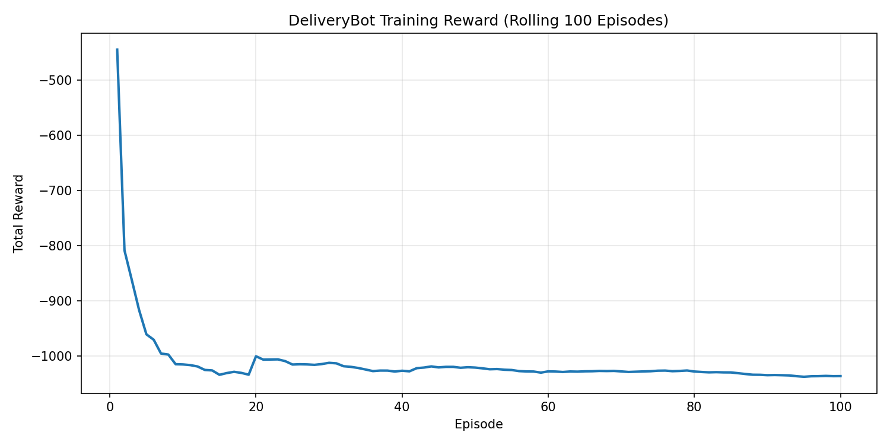
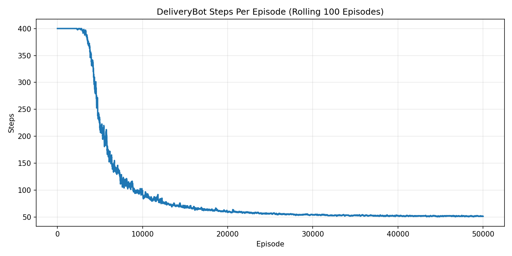
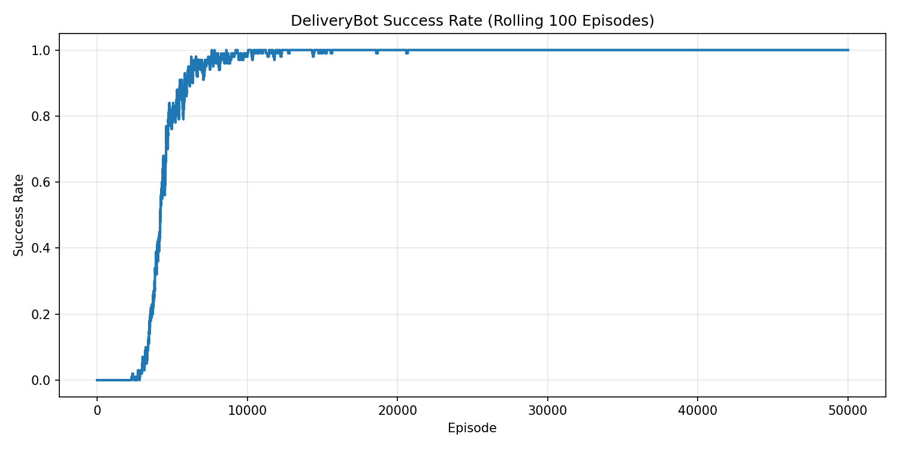

# Autonomous Delivery Robot: Q-Learning in a Grid-World Environment

## 1. Project Overview
This project simulates an autonomous delivery robot operating within a stylized 10x10 urban grid environment. The core objective is to employ **Reinforcement Learning (RL)**—specifically **Tabular Q-Learning**—to teach the robot an optimal policy for navigating from a central depot to execute complex multi-package delivery routing, while avoiding obstacles (buildings and planters).

The goal is not only to make the robot move, but to make it learn a useful delivery strategy through reinforcement learning. Instead of manually programming every route (such as A* or Dijkstra's), this project demonstrates how an agent can iteratively learn spatial navigation, inventory management, and task completion through trial and error, guided purely by an engineered reward function.

The project leverages a modular architecture separating configuration, environment, training, and execution logic:
- `config.py`: Hyperparameters and environment settings.
- `delivery_env.py`: The custom Gymnasium environment (`DeliveryBot-v0`).
- `train.py`: The Q-learning training loop.
- `run.py`: The evaluation and rendering script (Pygame).
- `main.py`: The primary entry point.

## 2. The Central Question
Before writing code, we should ask:
> *If a delivery robot is placed inside a city block with multiple pending deliveries and a limited carrying capacity, what information does it need in order to make a good decision?*

At first, the answer might seem simple:
- Where is the robot?
- Which packages are waiting to be picked up?
- Which packages is the robot currently carrying?
- Which packages have already been delivered?
- Which destination belongs to which package?

These questions naturally lead us to a reinforcement learning formulation. The robot is an **agent**. The city grid is the **environment**. Every time the robot chooses an action, the environment responds with a new state and a reward. Over many episodes, the robot learns which actions usually lead to successful completion of the entire job.

## 3. Environment Architecture (`DeliveryBot-v0`)
The simulation environment is implemented as a custom **Gymnasium** environment.

### 3.1 Spatial Dynamics
*   **Grid:** 10x10 discrete grid.
*   **Obstacles:** 
    *   16 impassable building cells configured in a block layout.
    *   8 impassable planter (grass) cells distributed across the environment.
    *   If the robot tries to move into an obstacle, the move is rejected and the robot receives a penalty. This forces the robot to learn paths around blocked areas.
*   **Locations of Interest:**
    *   **Depot:** Fixed at `(0, 0)`. The robot always begins its episode here or at a valid random start location.
    *   **Pickup Nodes:** 4 fixed locations `[(1,1), (1,8), (8,1), (8,8)]`.
    *   **Dropoff Nodes:** 4 fixed locations `[(0,5), (5,0), (5,9), (9,5)]`.

### 3.2 Multi-Package Delivery System
The environment supports a complex multi-package delivery task:
*   **Active Packages:** All 4 packages are active simultaneously.
*   **Capacity Constraint:** The robot can carry a maximum of 2 packages at any given time (`MAX_CARRY = 2`). It cannot simply pick up all 4 packages and then drop them off. It must plan intermediate deliveries to free up space.
*   **Randomized Destinations:** At the start of each episode, the mapping between the 4 pickup nodes and the 4 dropoff nodes is randomly shuffled (24 possible permutations). This ensures the robot learns a generalized policy rather than memorizing a single set of routes.

### 3.3 State Space
The state tells the robot what situation it is currently in. Because of the multi-package nature of the problem, the state needs to be incredibly detailed. 

The environment must provide a Fully Observable Markov Decision Process (MDP). The discrete state index encodes:
1.  **Robot X-coordinate** (0-9)
2.  **Robot Y-coordinate** (0-9)
3.  **Status of Package 0** (Waiting, Carried, Delivered)
4.  **Status of Package 1** (Waiting, Carried, Delivered)
5.  **Status of Package 2** (Waiting, Carried, Delivered)
6.  **Status of Package 3** (Waiting, Carried, Delivered)
    *(3 states per package -> $3^4 = 81$ combinations)*
7.  **Dropoff Permutation Index** (0-23)

*Total Theoretical State Space Size:* `10 * 10 * 81 * 24 = 194,400` discrete states.

**Why This Matters:** If the robot didn't know the Permutation Index, it wouldn't know which dropoff corresponds to the package it is holding. By encoding all this into a single integer, the Q-table can map every possible combination of events to an optimal action.

### 3.4 Action Space
The agent can select from a discrete action space of 6 potential actions:
*   `0`: **Move Up**
*   `1`: **Move Down**
*   `2`: **Move Left**
*   `3`: **Move Right**
*   `4`: **Pick up Package** (from a waiting package at the current cell, if capacity allows)
*   `5`: **Drop off Package** (for a carried package matching the current dropoff cell)

In this project, pickup and dropoff are explicit actions. The environment logic handles the capacity constraints. If the robot tries to pick up a 3rd package, the action fails and returns a penalty. The robot must learn when its inventory is full and route to a dropoff.

### 3.5 Reward Function
Rewards are how we communicate the objective to the robot. The reward structure enforces efficiency, safety, and task completion:

| Event | Reward | Reasoning |
| :--- | :---: | :--- |
| **Valid Step** | `-1` | Encourages the fastest route, prioritizing efficient logistics over meandering paths. |
| **Illegal Action** | `-10` | Penalizes collisions, invalid pickups (wrong location or at capacity), or invalid dropoffs. Teaches inventory management. |
| **Successful Pickup** | `+20` | Intermediate positive reinforcement for acquiring a package. |
| **Successful Dropoff** | `+100` | Reward for completing a specific delivery job. The episode terminates when all 4 packages are delivered. |

## 4. Q-Learning Algorithm
Q-learning is a reinforcement learning algorithm that learns the value of taking an action in a state. The main idea is: *For each state, estimate how good each possible action is.*

These estimates are stored in a matrix called the Q-table. Because the state space is `194,400` and there are `6` actions, the Q-table is a matrix of size `194,400 x 6`.

### 4.1 The Q-Learning Update Rule
The learning logic is executed in `train.py`. We utilize a Tabular Q-learning algorithm, updating the agent's action-value estimations according to the Bellman equation:

$$Q(s, a) \leftarrow Q(s, a) + \alpha [r + \gamma \max_{a'} Q(s', a') - Q(s, a)]$$

Where:
- `s`: Current state
- `a`: Action taken
- `r`: Reward received after taking the action
- `s'`: State after the action
- `α (alpha)`: Learning rate
- `γ (gamma)`: Discount factor
- `max(Q(s', a'))`: Best estimated future value

### 4.2 Hyperparameters (Defined in `config.py`)
*   **Training Duration (`TOTAL_EPISODES`):** `50,000` episodes.
*   **Episode Limit (`MAX_STEPS_PER_EPISODE`):** `400` steps.
*   **Learning Rate ($\alpha$):** `0.1` — Controls how fast Q-values update.
*   **Discount Factor ($\gamma$):** `0.99` — Represents the importance of future rewards. A value near 1.0 makes the agent heavily weight long-term success over immediate gratification.
*   **Exploration Strategy:** $\epsilon$-greedy approach.
    *   `EPSILON_START`: `1.0` (100% random exploration initially).
    *   `EPSILON_DECAY`: `0.9999` (Exploration reduction per episode). Because the state space is so massive (194k states), the robot needs a very slow epsilon decay to ensure it explores enough states before it starts exploiting its knowledge.
    *   `EPSILON_MIN`: `0.01` (Minimum 1% chance to explore).

## 5. Evaluation and Metrics (Insights)
During training, the system logs the agent's performance, producing rolling-average visualizations. These charts prove that the robot is actively learning the environment and improving its delivery strategy.

### 5.1 Training Rewards
The total reward per episode increases as the robot stops hitting obstacles and learns to manage its inventory effectively.



### 5.2 Training Steps
The number of steps required to terminate an episode decreases over time as the robot discovers optimal routing and the shortest paths to complete all 4 deliveries.



### 5.3 Delivery Accuracy
The success rate of delivering all 4 packages (Accuracy) approaches 100% as the agent solidifies its policy.



## 6. Visualizer
The environment features a comprehensive `pygame`-based rendering engine (`run.py`). It maps the internal matrix representation to visual assets (roads, sidewalks, crosswalks, buildings, planters, and an animated robot). 

Unique visual features for the multi-package system:
*   Waiting packages are rendered in distinct colors (Gold, Teal, Pink, Lime).
*   Dropoff markers (crosshairs) match the color of their respective packages and pulse dynamically when the package is being carried.
*   The robot dynamically displays miniature colored boxes on its chassis representing its currently carried cargo.

## 7. Setup & Execution Instructions

### Prerequisites
*   Python 3.10+
*   Dependencies: `gymnasium`, `numpy`, `matplotlib`, `pygame`

### Running the Project
The entry point for the project is `main.py`. The environment requires an active python virtual environment containing the necessary dependencies.

1.  **Standard Run (Train + Demo):**
    ```bash
    python main.py
    ```
    This script will train the model for 50,000 episodes, export the learning plots, save the policy to `delivery_qtable.npy`, and spawn a Pygame window showing simulated test runs.

2.  **Headless Training (No Pygame Demo):**
    ```bash
    python main.py --skip-demo
    ```

3.  **Run Demo from Saved Policy:**
    ```bash
    python main.py --demo-only
    ```

4.  **CLI Arguments:**
    *   `--episodes <int>`: Number of training episodes.
    *   `--demo-episodes <int>`: Number of test runs to render.
    *   `--demo-step-delay <int>`: Time step delay (ms) for the visualization.

## 8. Conclusion
This project successfully demonstrates how reinforcement learning can solve complex logistics problems that are difficult to hardcode. Writing a script to manually route a robot with a 2-package capacity to 4 random destinations, while avoiding obstacles, is a complex pathfinding problem. The RL agent solves this natively just by pursuing the reward.

The resulting Q-table (`delivery_qtable.npy`) acts as the robot's learned memory. For any of the 194,400 possible situations the robot might find itself in, the table holds the answer to the question: *"What is the most profitable action to take next?"*